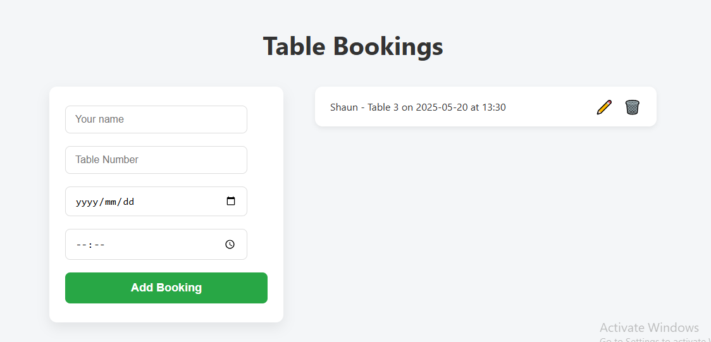

# 🪑 Table Booking App

A simple and efficient web application built with **Flask** that allows users to book, view, edit, and delete table reservations. Designed to help restaurants, cafes, or shared spaces manage bookings effortlessly using a clean and intuitive UI.

---

## 📖 Introduction

The **Table Booking App** is a full-stack web application that enables users to manage table reservations online. Built using **Flask** and **PostgreSQL**, this application includes all the CRUD operations required for managing bookings. It’s a great starter project for learning Flask, database integration, and deployment to services like **Render** or **Supabase**.

---

## ✨ Features

✅ Add new table bookings  
✅ View all bookings in a clean dashboard  
✅ Edit or update existing bookings  
✅ Delete bookings  
✅ Responsive UI using HTML + CSS + Jinja2  
✅ Integrated with PostgreSQL via SQLAlchemy ORM  
✅ Easily deployable on Render or Supabase  

### 🔍 Screenshots

#### 🏠 Home Page

#### ➕ Add Booking

#### 📝 Edit Booking

#### 📝 Delete Booking

----

## 🛠 Tech Stack

| Layer       | Technology                 |
|-------------|----------------------------|
| Frontend    | HTML, CSS, Jinja2          |
| Backend     | Flask (Python), SQLAlchemy |
| Database    | PostgreSQL (Supabase)      |
| Deployment  | Render                     |
| Version Control | Git + GitHub           |

---

## 🤝 Contribution

Contributions are welcome! Here's how you can contribute:

1. Fork this repository
2. Create a new branch: `git checkout -b feature/your-feature-name`
3. Make your changes and commit: `git commit -m 'Add new feature'`
4. Push to the branch: `git push origin feature/your-feature-name`
5. Create a pull request 🚀

---

## 📄 License

This project is licensed under the MIT License.  

---

## 🙏 Acknowledgements

- Flask documentation – https://flask.palletsprojects.com/
- SQLAlchemy documentation – https://docs.sqlalchemy.org/
- Render – https://render.com/
- Supabase – https://supabase.com/
- Icons – [Font Awesome](https://fontawesome.com/)
- Template inspiration from various open-source projects

---

 Built with ❤️ by Vuyolwethuh Mfidi – (https://github.com/mfidiv)
